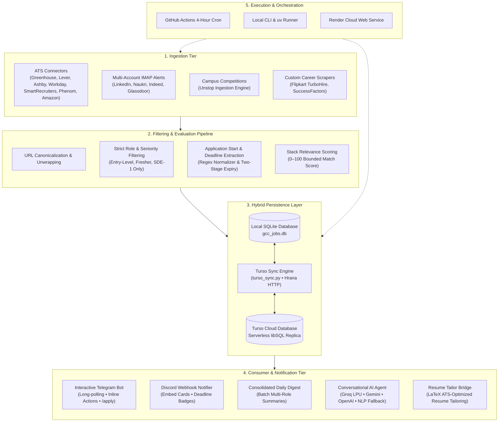

# gcc-job-radar

> High-performance Python CLI tool and personal job-hunt optimization suite that queries canonical ATS APIs (Greenhouse, Lever, Ashby, Workday, SmartRecruiters, Amazon Jobs, Phenom) and multi-account email alerts to aggregate, filter, score, and track verified entry-level tech roles (SDE-1, Junior Engineer, Associate, Fresher, Tech Intern) in India from 4,800+ global tech companies and Global Capability Centers (GCCs).

---

## Key Features

- **Direct Canonical ATS Integrations**:
  - **Greenhouse**: `https://boards-api.greenhouse.io`
  - **Lever**: `https://api.lever.co/v0/postings`
  - **Ashby**: `https://api.ashbyhq.com/posting-api`
  - **Amazon Jobs**: Direct API querying `https://www.amazon.jobs/en/search.json` for India SDE-1 and tech roles.
  - **Workday & SmartRecruiters**: Native enterprise career site integrations.
  - **Phenom / SuccessFactors**: Career portal scrapers for enterprise GCCs.
- **Multi-Account Email Job Alert Ingestion (IMAP SSL)**:
  - Ingests job alerts from **LinkedIn, Naukri, Indeed, and Glassdoor** delivered to up to multiple configured email accounts (`EMAIL_USER`, `EMAIL_USER_2`, etc.).
  - Extracts job cards, resolves canonical career portals, filters through entry-level criteria, and stores them in SQLite.
  - Recruiter revert detector (`check_reverts`) to monitor interview invitations and online assessments (OA).
- **Curated GCC & Tech Hub Directory**: Pre-configured with **4,800+ foreign GCCs, high-growth startups, and enterprise tech companies** operating in India (Amazon, Databricks, Stripe, Figma, Atlassian, Snowflake, Rubrik, Cisco, BT Group, Celonis, Elastic, Cloudflare, DoorDash, Docker, Coinbase, Robinhood, Ripple, Palantir, and more).
- **Strict Level & Location Filters**: Surfaces entry-level roles (SDE-1, Junior Software Engineer, Associate, Fresher, Intern) while strictly filtering out Senior, Lead, Staff, Principal, Architect, Manager, and Roman/numeric levels II through VI. Covers Indian tech hubs (Bengaluru, Hyderabad, Pune, Gurgaon, Noida, Mumbai, Chennai, Delhi NCR) and India Remote.
- **Stack-Relevance Scoring Engine**: 
  - Automatically calculates bounded **0–100 relevance scores (`[pts]`)** for each role matching modern backend and full-stack profiles: **Java / Spring Boot 3, MERN (MongoDB, Express, React, Node.js), Kafka, MySQL, Docker, JWT, GitHub Actions**.
  - Color-coded scores in terminal output (Green for 80+, Yellow for 60–79, Dim/Gray for <60).
  - Penalizes non-stack roles (e.g. pure iOS, Ruby, Embedded) when target stack keywords are absent.
- **Application Tracking & Stale Follow-up Pipeline**:
  - Full application lifecycle tracking: `NEW` ➔ `APPLIED` ➔ `INTERVIEWING` / `REJECTED` / `DISMISSED`.
  - Automatic stale application tracking: alerts when applications have been pending for more than 7 days (or user-defined threshold) without status updates.
  - Pipeline summary metrics and follow-up alerts via CLI and Telegram.
- **Daily Digest Mode**:
  - Consolidates notifications into a single cleanly-formatted digest per scan instead of spamming individual messages.
  - Groups discovered roles by company with direct ATS application links.
  - Supports both **Discord** and **Telegram** webhook/bot deliveries.
- **Application Start Dates & Closing Deadlines**:
  - Automatically extracts and normalizes application start dates and closing deadlines from job descriptions, emails, and competition requirements (`regnRequirements`).
  - Alerts format dates clearly: `📅 Posted: {start_date} • ⏳ Closes: {end_date}`.
  - **Two-Stage Automatic Expiry Lifecycle**: Expired roles are immediately deactivated upon ingestion and pruned before scans so closed roles never resurface, while candidate tracking history (`APPLIED`, `INTERVIEWING`) remains protected.
- **Turso Cloud Database Synchronization**:
  - Seamlessly integrates serverless Turso (libSQL/SQLite in the cloud) via pure-Python Hrana HTTP transport.
  - Bidirectional sync (`gcc-job-radar db-sync --pull / --push / --status`) bridges local development, interactive Telegram bot instances, and GitHub Actions runners.
  - Prevents data loss and permanently eliminates duplicate alerts caused by CI cache evictions.
- **Conversational AI Career Agent**:
  - Natural language CLI queries via `gcc-job-radar ask "<question>"`.
  - Multi-provider resilient LLM chain: **Groq (LPU) ➔ Gemini ➔ OpenAI ➔ Rule-based NLP**.
  - Interactive Telegram bot for live scans, status updates, mobile career advice, and one-click application tracking.
- **Rich Terminal UI & Flexible Exports**:
  - Fast execution via `uv run gcc-job-radar` or standard CLI.
  - Animated progress bars, styled tables, and clickable terminal apply URLs.
  - Clean export options to JSON (`--json`) and CSV (`--csv`).

---

## Installation

```bash
# Clone the repository
git clone https://github.com/Chinmay0608/Project_Beta.git gcc-job-radar
cd gcc-job-radar

# Install in editable mode
pip install -e .

# Or with development dependencies for testing
pip install -e ".[dev]"
```

---

## Usage & CLI Commands

### 1. Scanning for Roles

```bash
# Full scan across all 150+ configured companies
gcc-job-radar

# Scan a single company
gcc-job-radar --company databricks
gcc-job-radar --company celonis

# Display only newly discovered roles (unseen in SQLite)
gcc-job-radar --new-only

# Filter results by minimum stack-relevance score (0–100)
gcc-job-radar --min-score 70

# Send a single consolidated daily digest instead of individual alerts
gcc-job-radar --digest --notify-discord "https://discord.com/api/webhooks/xxx/yyy"

# Export findings to JSON and CSV
gcc-job-radar --json latest_openings.json --csv latest_openings.csv
```

### 2. Application Tracking & Follow-ups

Track job applications as your personal daily source of truth:

```bash
# View stale applications pending follow-up (default: >7 days since applied)
gcc-job-radar stale

# Check stale applications older than 14 days
gcc-job-radar stale --days 14

# List tracked applications with pipeline filtering
gcc-job-radar list --status APPLIED --stale --stale-days 7

# View database statistics and pipeline breakdown
gcc-job-radar --stats
```

### 3. Managing Dormant Companies

Avoid scanning inactive or paused career portals while keeping tracking flexible:

```bash
# List all currently dormant companies and their reasons
gcc-job-radar dormant

# Reactivate a company to resume active scanning
gcc-job-radar reactivate backblaze

# Auto-dormant flags during scan (mark dormant after 10 consecutive empty scans)
gcc-job-radar scan --auto-dormant-threshold 10
```

### 4. Querying the AI Career Agent

Ask questions directly from your terminal using natural language:

```bash
# Query active listings by stack and location
gcc-job-radar ask "Are there any Spring Boot or Java backend roles in Bangalore or Hyderabad?"

# Check application status
gcc-job-radar ask "What roles have I applied to?"

# Inquire about market compensation or interview advice
gcc-job-radar ask "Which foreign GCCs offer compensation over 15 LPA for freshers?"

# Get database statistics
gcc-job-radar ask "How many total jobs are tracked in the database?"
```

### 5. Database & Cloud Synchronization (Turso)

Synchronize local state with your Turso cloud database across machines and CI:

```bash
# Compare row counts between local SQLite and Turso cloud database
gcc-job-radar db-sync --status

# Pull latest state from Turso into local SQLite
gcc-job-radar db-sync --pull

# Push local records to Turso cloud
gcc-job-radar db-sync --push
```

---

## Interactive Telegram Bot

Start the interactive long-polling bot to receive alerts and manage job applications from your phone:

```bash
gcc-job-radar bot --token "TELEGRAM_BOT_TOKEN" --chat-id "TELEGRAM_CHAT_ID"
```

### Supported Bot Commands:
- `/scan` — Triggers a live scan across all configured GCCs.
- `/check <company>` — Scans a specific company (e.g. `/check celonis`, `/check databricks`).
- `/stats` — Displays application pipeline metrics and top tracked companies.
- `/latest` — Shows the 5 most recently discovered postings with direct ATS apply URLs.
- `/followups` (or `/stale`) — Shows applied roles awaiting follow-up (>7 days old).
- `/apply <id or company>` — Marks a role as APPLIED in the tracker.
- `/dismiss <id or company>` — Dismisses/hides a role from future alerts.
- Natural Language Chat — Send any question directly in Telegram to talk to the AI agent.

> **Security Note**: The bot strictly authenticates incoming messages against `--chat-id` (or `TELEGRAM_CHAT_ID`) and rejects unauthorized senders.

---

## AI Agent & LLM Configuration

The AI assistant utilizes a resilient multi-provider fallback architecture. If your primary API key is exhausted or encounters rate limits, it automatically shifts to secondary providers, and falls back to a deterministic rule-based NLP engine if no LLM keys are present.

### Environment Variables

Configure your preferred providers in your `.env` file or environment:

```bash
# Primary: Google Gemini (default model: gemini-2.5-flash / gemini-3.1-flash-lite)
export GEMINI_API_KEY="AIzaSy..."

# Secondary / Fast Inference: Groq (ultra-fast LPU inference, e.g. llama-3.3-70b-versatile)
export GROQ_API_KEY="gsk_..."

# Tertiary: OpenAI (model: gpt-4o-mini)
export OPENAI_API_KEY="sk-..."

# Optional: Set primary provider preference ("gemini" or "groq", default: "gemini")
export PRIMARY_LLM_PROVIDER="gemini"
```

### Resilient Fallback Chain:

```
[User Query]
      │
      ▼
┌──────────────┐     Fails / Unconfigured
│ Google Gemini│ ────────────────────────► ┌──────────────┐
└──────────────┘                           │  Groq (LPU)  │
                                           └──────────────┘
                                                  │ Fails / Unconfigured
                                                  ▼
                                           ┌──────────────┐
                                           │    OpenAI    │
                                           └──────────────┘
                                                  │ Fails / Unconfigured
                                                  ▼
                                           ┌──────────────────────┐
                                           │ Rule-based NLP Engine│ (Zero API key needed)
                                           └──────────────────────┘
```

---

## Automating with GitHub Actions

A production-ready GitHub Actions workflow is included at [`.github/workflows/job_radar_cron.yml`](.github/workflows/job_radar_cron.yml).

#### Workflow Features:
1. **Scheduled Runs**: Runs automatically every 4 hours (`cron: '0 */4 * * *'`).
2. **Turso Cloud Database Synchronization**: Automatically pulls latest database state before scanning and pushes new discoveries, statuses, and pruning back to Turso in the cloud.
3. **Daily Digest Support**: Dispatches consolidated digests directly to Discord and Telegram.
4. **Artifact Retention**: Automatically uploads `latest_openings.json` and tailored resumes as build artifacts retained for 7 days.
5. **Manual Triggering**: Triggerable on-demand via the **Actions** tab with custom company filters and digest flags.

### GitHub Secrets Setup:
Configure these in **Settings** ➔ **Secrets and variables** ➔ **Actions**:
- `TURSO_DATABASE_URL` — Turso database URL (`libsql://...`).
- `TURSO_AUTH_TOKEN` — Turso JWT authorization token.
- `DISCORD_WEBHOOK_URL` — Discord webhook URL.
- `TELEGRAM_BOT_TOKEN` — Telegram Bot API token.
- `TELEGRAM_CHAT_ID` — Authorized Telegram Chat or Channel ID.
- `EMAIL_USER` / `EMAIL_PASSWORD` — Primary email address & Google App Password for job alerts.
- `EMAIL_USER_2` / `EMAIL_PASSWORD_2` — (Optional) Secondary email account.
- `EMAIL_USER_3` / `EMAIL_PASSWORD_3` — (Optional) Tertiary / college email account.
- `GEMINI_API_KEY` / `GROQ_API_KEY` — (Optional) For automated AI agent analysis.

---

## Testing

Run the full automated test suite using `pytest`:

```bash
pytest -v
```

Linting and code quality:
```bash
pyflakes gcc_job_radar tools tests
```

---

## Architecture Overview

GCC Job Radar is engineered as a modular, event-driven, and multi-tier job intelligence pipeline. It continuously monitors career boards, email alerts, and campus portals, normalizes and validates openings, maintains a synchronized cloud/local persistence layer, and surfaces opportunities through rich interfaces and conversational agents.

### High-Level System Architecture



### Architectural Pillars

1. **Ingestion Tier (Multi-Source Harvesting)**:
   - **Direct ATS APIs**: Native async HTTP connectors query canonical endpoints for Greenhouse, Lever, Ashby, Workday, SmartRecruiters, Phenom, and Amazon Jobs with concurrency throttling via `httpx` semaphores.
   - **Multi-Account IMAP Ingestor**: Connects across up to 3 email accounts over IMAP SSL, parses job alert emails from LinkedIn, Naukri, Indeed, and Glassdoor, and unwraps redirect tracking parameters into clean canonical URLs.
   - **Campus & Hackathon Feeds**: Ingests fresher competitions, hiring challenges, and off-campus drives from Unstop.

2. **Processing & Evaluation Pipeline**:
   - **Canonicalization**: Strips UTM tracking, recruiter tokens, and redirects to ensure unique primary key mapping across all platforms.
   - **Strict Negative & Positive Level Filtering**: Enforces entry-level eligibility (Fresher, Associate, Intern, SDE-1) while discarding Senior, Lead, Staff, Principal, and numeric levels II–VI.
   - **Stack-Relevance Scoring Engine**: Calculates bounded 0–100 match scores based on modern full-stack competencies (Java, Spring Boot, MERN, Kafka, Docker, MySQL, AWS).
   - **Application Dates & Automatic Expiry Lifecycle**: Detects application start dates and closing deadlines (`extract_application_dates`). Automatically expires past-deadline roles on ingestion and scheduled pruning while strictly preserving candidate tracking history (`APPLIED`, `INTERVIEWING`).

3. **Hybrid Persistence & Synchronization (Turso Cloud libSQL)**:
   - **Zero-Latency Local Operations**: Scans and CLI commands query local SQLite (`gcc_jobs.db`) in microseconds for high-throughput batch operations.
   - **Cloud Sync Engine (`turso_sync.py`)**: Uses Turso's pure-Python Hrana HTTP transport to pull state before scans and push discoveries after scans.
   - **Cross-Environment State Parity**: Keeps local development, mobile Telegram interactions, and ephemeral GitHub Actions runners completely in sync, permanently eliminating CI cache eviction issues and duplicate alert loops.

4. **Consumer & Notification Interfaces**:
   - **Interactive Telegram Bot**: Long-polling daemon supporting instant mobile scanning (`/scan`), status tracking (`/apply`, `/interviewing`, `/dismiss`), and stale application alerts.
   - **Discord & Digest Notifications**: Color-coded rich embed cards with clickable application links, location indicators, and closing deadline countdowns.
   - **AI Career Agent & Resume Bridge**: Resilient multi-provider LLM chain (Groq LPU ➔ Gemini ➔ OpenAI ➔ Rule-based NLP) providing natural-language querying and automated LaTeX resume tailoring for high-priority openings.
